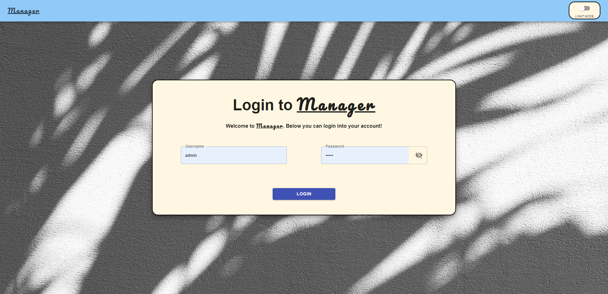
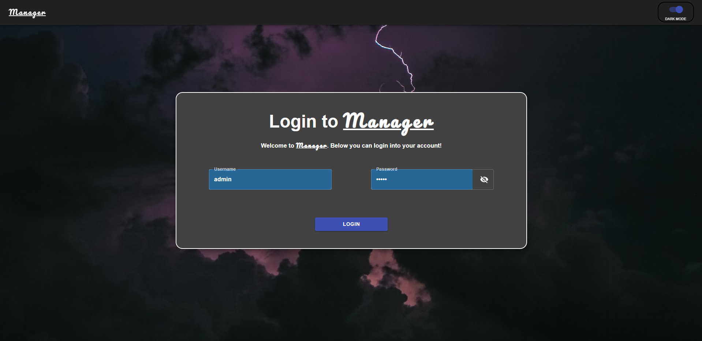
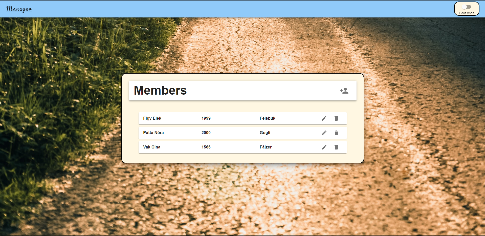
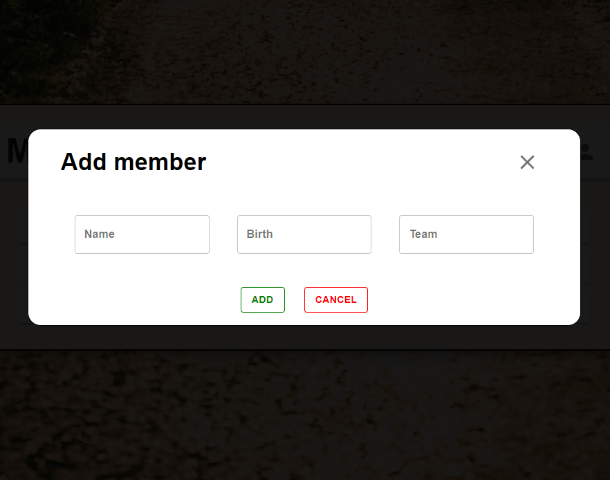
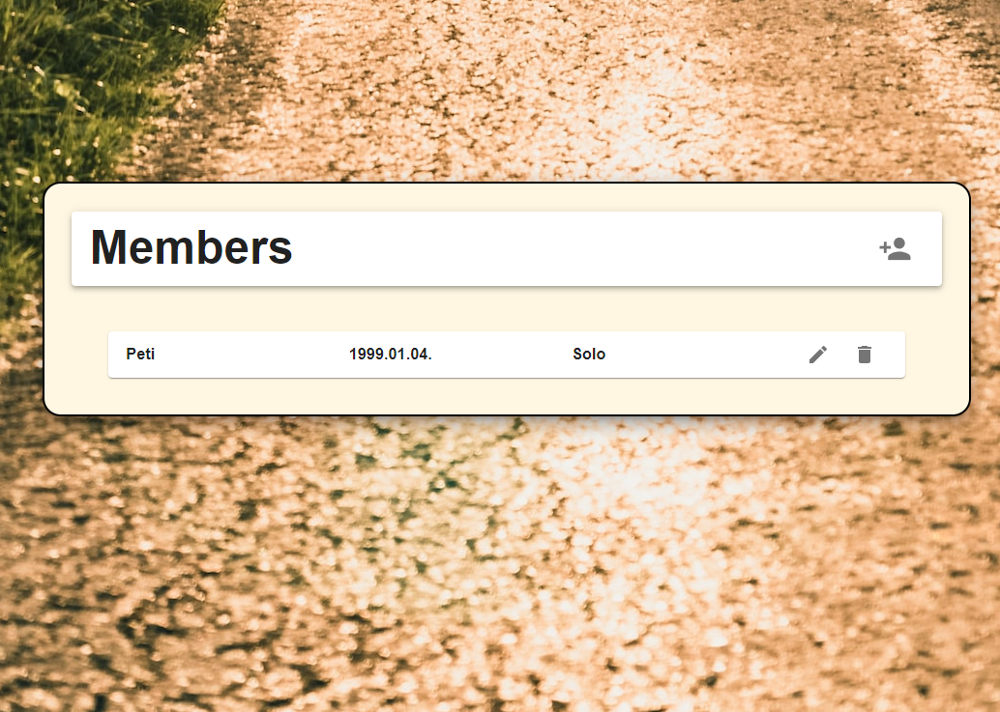

# Manager App - magyar
 
English version [below](#manager-app---english) 

Heló! Köszöntelek a Manager App projektem GitHub repójában. Ez egy végtelenül egyszerű program, amiben bejelentkezni, új felhasználókat felvenni, illetve a sötét-világos témán változtatni lehet. Ez csak egy teszt projekt a MaterialUI CSS keretrendszer, a React és az Express együttes működésének a kipróbálására.

> Az app látványképei megtalálhatók a **"visuals"** mappában illetve ezen *markdown* legalján: [klikk](#látvány--visuals).

# Fájlrendszer

A React project maga a gyökérkönyvtár. Ezen belül rejtőzik el az Express projekt, a backend mappán belül.

# Függőségek telepítése

Mind a gyökérben, mind a backend mappában ki kell adni az "npm install" parancsot a függőségek telepítéséért.

# Futtatás

A React projektet a gyökérben állva "npm start" paranccsal, a backend Express projekt pedig a "backend" mappában állva "node app.js" paranccsal indítható el.

> A React alkalmazás a 3000-as, a back-end alkalmazás az 5000-es porton indul el alapértelmezetten.

# Manager App - english

Hello! Welcome to the GitHub repo of my Manager App project. This is an extremely simple program that allows users to log in, create new users, and switch between light and dark themes. This is just a test project to try out the MaterialUI CSS framework, React, and Express working together.

> The app images can be found in the **"visuals"** folder or at the bottom of this *markdown*: [click](#látvány--visuals)..

# Project directory

The React project itself is in the root directory. The Express project is hidden within the "backend" folder.

## Installing dependencies

You need to run the "npm install" command in both the root directory and the backend folder to install the dependencies.

# Running

To start the React project, run the "npm start" command in the root directory. To start the backend Express project, run the "node app.js" command in the backend folder.

> The React app runs on port 3000 and the backend app runs on port 5000 by default.

# Látvány | Visuals

  
   Főképernyő | Main screen

  
   Főképernyő sötétben | Dark theme main screen

  
   Felhasználó kezelés | User management

  
   Hozzáadás | Add member 

  

